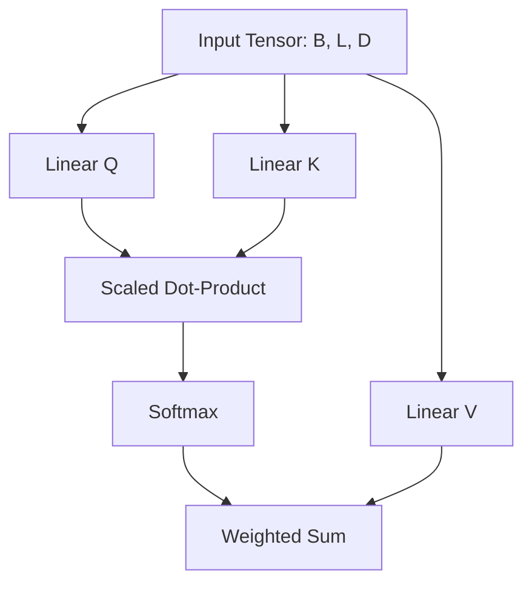

# Mermaid Visualizer (Architecture-to-Diagram)

Esta skill permite aterrizar la complejidad de las arquitecturas del máster en representaciones visuales claras. Convierte bloques de ecuaciones y texto en diagramas estructurados.

## Flujos de Trabajo Principales

### 1. Visualización de Arquitecturas
Cuando expliques una arquitectura compleja (ej: Bloque de Attention, ResNet stage, UNet Bottleneck):
- **Acción:** Genera un bloque de código `mermaid` detallado.
- **Formato:** Utiliza `graph TD` para flujos de datos o `sequenceDiagram` para interacciones temporales (ej: procesos de difusión).
- **Detalle:** Incluye los `shapes` de los tensores en las conexiones entre nodos (cumpliendo con el Formats Hook).

### 2. Diagramas de Decisión
Usa diagramas Mermaid para explicar algoritmos de entrenamiento, ciclos de RLHF o procesos de optimización.

## Instrucción Crítica
"Si explicas una arquitectura compleja, genera siempre un bloque mermaid para visualizar el flujo de datos".

## Ejemplo de Salida (Bloque de Atención)

